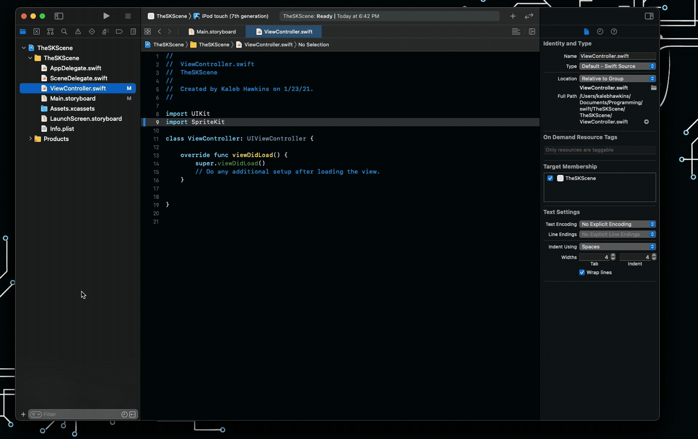
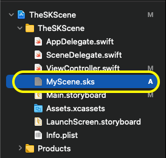

# Getting Started

## What is Spritekit?

Apple describes Spritekit as a general-purpose framework for drawing shapes, particles, text, images, and video in two dimensions. It leverages Metal to achieve high-performance rendering while offering a simple programming interface to make it easy to create games and other graphics-intensive apps. Using a rich set of animations and physics behaviors, you can quickly add life to your visual elements and gracefully transition between screens.

## Your First Project

This first project will be simple. The goal is to draw a circle.

## Get Xcode
The first thing to do is ensure [Xcode](https://apps.apple.com/us/app/xcode/id497799835?mt=12) is downloaded and installed.


## Creating the Project

1. Open Xcode  
2. Create a new project  
3. Select IOS  
4. Select App  
5. Fill out the required fields

`Product Name: WhateverYouWant`  
`Team: WhatEverYouWant`  
`Organizational Identifier: com.whateverYouWant`  
`Interface: Storyboard`  
`Lifecycle: UIKit App Delegate`  
`Language: Swift`  


## The SKView Class

In Apple's documentation, they walk through creating a Scene, drawing a node, and finally presenting the scene. They don't explain setting up the `View` that you present. The `View` needs to be of class `SKView`. 

The `SKView` class is primarily used to present a `SKScene`. There are many other methods that `SKView` can support but for simplicity these will be covered in later tutorials.

### Setup SKView

There are two ways to set the `View` as a `SKView`. The first method is to go to your `Main.Storyboard` file and select the main `View` and change its class to `SKView` as seen in the images below.

 


The second method is to set the `View` programmatically. It is not recommended to use this approach because of bug encounters with it.

## Integrating Spritekit

Navigate to the `ViewController.swift` file there will be code very similar to the following:


```swift
import UIKit

class ViewController: UIViewController {

    override func viewDidLoad() {
        super.viewDidLoad()
        // Do any additional setup after loading the view.
    }
}
```

To integrate Spritekit into the project use the `import Spritekit` statement to import the framework into the project.

```swift
import UIKit
// Import Spritekit here
import Spritekit 

class ViewController: UIViewController {
    //...
}
```

## The SKSceneClass

A `SKScene` object represents a scene of content in SpriteKit. A scene is the root node in a tree of SpriteKit nodes (`SKNode`). These nodes provide content that the scene animates and renders for display. To display a scene, you present it from an `SKView`, `SKRenderer`, or `WKInterfaceSKScene`.

There are many things that can be done with the `SKScene` object:

- Stretch the Content to Fit the View
- Configure the ViewPort (Define what part of the scene is visible at a given time)
- Respond to loading and resizing events
- Respond to Frame-Cycle events
- Delegating a scene
- Change background appearance 
- Configure Physics
- Add positional audio

Note that a `SKScene` inherits from the `SKEffectNode`. That means anything that can be done with the `SKEffectNode` can be performed on a `SKScene`. These action can include:

- Apply Core Image Filters
- Warping Nodes
- Applying Shaders
- Flatten Node Tree's for improved performance
- Configure Alpha blending

### Creating SKScene

Everything displayed with SpriteKit is done through a scene object, which is an instance of `SKScene`. To set up a `SKScene` use the following code:

```swift
import UIKit
import Spritekit

class ViewController: UIViewController {
        
    override func viewDidLoad() {
        super.viewDidLoad()
    
        // Check the view to ensure it is of type SKView
        if let skView = view as? SKView {
            // Initialize a SKScene object. 
            // By passing the size of the view's bounds 
            // the scene will fit to the screen.
            let scene = SKScene(size: skView.bounds.size)
            
            // Present the scene
            skView.presentScene(scene)
        }
    }
}
```

### Creating a Scene File

Instead of creating a scene from a `View`'s size, a file can be used. To create a scene file press ++cmd+n++, search scene in the filter and select `Spritekit Scene`. Careful not to select `Scenekit Scene`. 



This will put you in Xcode's scene editor. This is where base configuration of the scene should take place.  



### Linking the Scene

Now to link the file up to the code. Navigate back to the `ViewController.swift` file and use the following code.  

```swift
import UIKit
import SpriteKit

class ViewController: UIViewController {

    override func viewDidLoad() {
        super.viewDidLoad()
        
        if let skView = view as? SKView {
            // Use the SKScene(fileName:) function to load the scene.
            // The string "MyScene" comes from the name of the sks file.
            // So if the name of the file was Level01.sks you would replace "MyScene" with "Level01"
            if let scene = SKScene(fileNamed: "MyScene") {
                // Set the scenes anchor point (origin)
                scene.anchorPoint = CGPoint(x: 0.5, y: 0.5)
                
                // Present the scene
                skView.presentScene(scene)
            }
        }
    }
}
```

> Don't worry about line 15 for now. It is explained in detail in the [next tutorial](002-MovingNodes.md).

Compile and run your code using ++cmd+r++. You should see an empty grey screen.


### Modifying the Scene

The `SKScene` editor is handy for the base configuration of a scene. It also cuts down on code pollution in the source files. Take time to explore and get a feel for what can be done with the editor. 

For example navigating back the `MyScene.sks` and changing the background color can be done by clicking the `Attributes Inspector` and selecting the color from the `color` attributes.


## Adding Sprites and Nodes to the Scene

You can can sprites and nodes to the scene using the editor as well. Back in the `.sks` file click the ++"+"++ button in the upper right hand corner of the scene editor. 


Notice that the context of the attributes editor changes when selecting a node. This allows for different aspects of the node to be modified. 

## The Scene's Node Tree

The editor allows you to visualize your nodes in a tree-like structure. Nodes can be nested and organized. When a node is nested below another node it becomes a `child` or it's `parent` node. Things like inheritance for certain attributes take place unless overridden by the child node. These are important concepts to keep in mind. 


## Adding Nodes Programmatically

The `ViewController` should be filled with code specific to the `ViewController`. Nodes, sprites, and other game objects should reside within their own scene. To make this work a class should be created to manage the `sks` file programmatically. 

Add a new file to the project by pressing ++cmd+n++ and selecting `Swift File`.


Next set the `Custom Class` of the `.sks` scene file to the name of the new class. In this case the name will be `MyScene`.


Create the `MyScene` custom class in the `MyScene.swift` file.


```swift
import SpriteKit

// Create an SKScene class with the name MyScene
class MyScene: SKScene {
    
    // Create a circle shape with SKShapeNode
    let circle = SKShapeNode(circleOfRadius: 50)
    
    // Use the SKScene.didMove(to view: SKView) method to modify any attributes of the node.
    override func didMove(to view: SKView) {

        // Set the node's fill color to red.
        circle.fillColor = .red

        // Add the circle as a child to the scene
        addChild(circle)
    }
}
```

> The `didMove(to view: SKView)` function is intended to be overridden in a subclass. Use this method to implement any custom behavior for the scene when it is about to be presented by a view. 

Remove any nodes placed in the scene from the editor and then compile and run your code using the ++cmd+r++ keys. Something very similar to the below image should appear. It may take a few minutes the first time the project is compiled.


## Congratulations

You have completed the first project. You have something to show! Getting this far takes a lot of work.  

## Exercises 

Here are some challenges. Remember when doing these exercises that documentation and Google are tools. There is no shame in using them. The [references](#references) will help guide you through the exercises.

### Questions
- [ ] What is a `SKView`?
- [ ] What is a `SKScene`?
- [ ] What is a `SKNode`?

### Challenges
- [ ] Change the color of the circle.
- [ ] Change the border color of the circle.
- [ ] Change the background color of the scene.
- [ ] Add a square shape to the scene.
- [ ] Change the position of the shapes.
- [ ] Create a new scene with a different background color and present that scene.
- [ ] Read the `SKScene` documentation (see the [References](#references)).
- [ ] Change the Scenes `origin`.
- [ ] Set the position of a node using the editor.
- [ ] Understand the `sceneDidLoad()`, `didChangeSize(CGSize:)`,  `willMove(from: SKView)`, `didMove(to: SKView)` functions and how/when to use them.
- [ ] Review the `Conforms To` and `Essentials` section of `SKScene` documentation.
- [ ] Try to configure physics (you will need a node with a `physicsbody`).

*Solutions Coming Soon*

## References 

- [SKView Documentation](https://developer.apple.com/documentation/spritekit/skview)
- [SKScene Documentation](https://developer.apple.com/documentation/spritekit/skscene)
- [SKShapeNode Documentation](https://developer.apple.com/documentation/spritekit/skshapenode)
- [Google](https://www.google.com/)
- [SKScene Origin](https://developer.apple.com/documentation/spritekit/skscene/positioning_a_scene_s_origin_within_its_view)
- [Creating a SKScene from File](https://developer.apple.com/documentation/spritekit/skscene/creating_a_scene_from_a_file)
- [Google](https://www.google.com/)

## Extra Reading

The link below is the documentation explaining different nodes and node types. It is recommended you at least read over the section `Using Base Nodes to Lay Out SpriteKit Content` and `Maximizing Node Drawing Performance` to get a general idea of the capabilities of different nodes.

- [Nodes for Scene Building](https://developer.apple.com/documentation/spritekit/nodes_for_scene_building#2242745)
