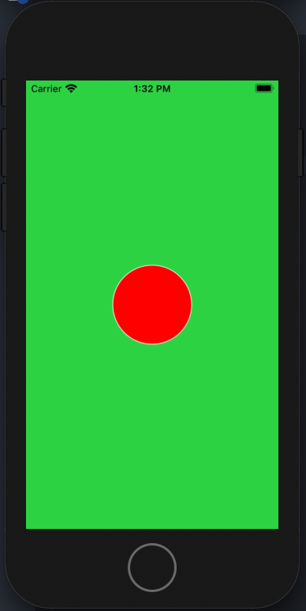
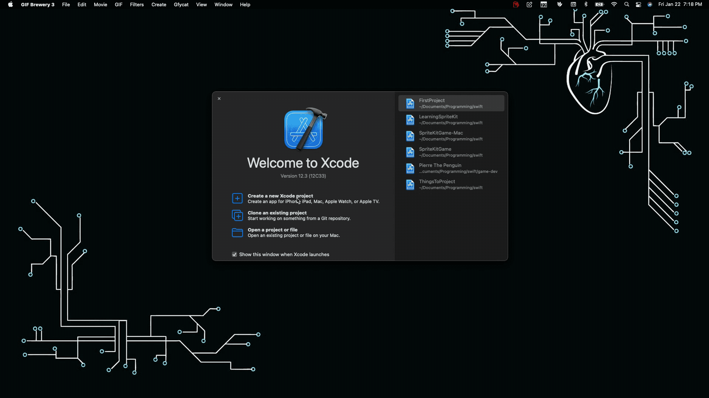
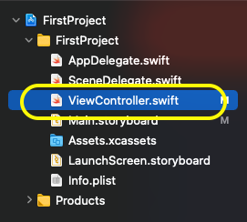

# Creating A Scene Using Spritekit

Apple describes Spritekit as a general-purpose framework for drawing shapes, particles, text, images, and video in two dimensions. It leverages Metal to achieve high-performance rendering while offering a simple programming interface to make it easy to create games and other graphics-intensive apps. Using a rich set of animations and physics behaviors, you can quickly add life to your visual elements and gracefully transition between screens.

## Quick Word
Welcome to the first step in beginning your iOS game development journey. I hope this will be as much a learning experience for anyone reading this as it will be for myself. 

I will assume that you have some prior experience with iOS development. Below are some highly recommended references if you don't have previous experience.

| Course | Description |
| --- | --- | 
| [Angela Yu's Udemy Course](https://www.udemy.com/course/ios-13-app-development-bootcamp/learn/lecture/16261222?start=0#overview) | One of the best places to start learning iOS development. The course stays updated, is of high quality, and the teaching style is at a pace that anyone could keep up. |
| [Stanford University CS193p 2017-2018](https://www.youtube.com/watch?v=TZL5AmwuwlA&list=PL3d_SFOiG7_8ofjyKzX6Nl1wZehbdiZC_) | This is an excellent resource to learn iOS development. 
| [Stanford University CS193p 2020](https://www.youtube.com/watch?v=jbtqIBpUG7g&list=PLpGHT1n4-mAtTj9oywMWoBx0dCGd51_yG&index=14) | This is a faster-paced course but covers things in great detail. The course focuses on SwiftUI. | 
| [Hacking With Swift](https://www.hackingwithswift.com) | Search anything involving Swift HackingWithSwift will appear. The content is high quality. |
| [Ray Wenderlinch](https://www.raywenderlich.com) | A site much like HackingWithSwift. There is high-quality content here.

Do not try to consume everything from every link listed above. Doing so will burn anyone out with little to no progress. The best thing to do is learn concepts and then put those concepts to practice. 
## Your First Project

This first project will be something simple. The goal is to draw a scene and a shape.



We are going to create a `Single View App` then add Spritekit to it. The process for adding Spritekit to a project is described in [Apple's Developer Documentation](https://developer.apple.com/documentation/spritekit/drawing_spritekit_content_in_a_view) but is difficult to follow. I recommend you read the page linked after this tutorial and try to understand it. 

### Get Xcode
The first thing to do is ensure you have [Xcode](https://apps.apple.com/us/app/xcode/id497799835?mt=12) downloaded and installed.


### Creating the Project
Now let's create a project. You can follow the gif below to see how to do that. 

The steps are as follows:  
1. Open Xcode  
2. Create a new project  
3. Select IOS  
4. Select App  
5. Fill out the required fields

`Product Name: WhateverYouWant`  
`Team: WhatEverYouWant`  
`Organizational Identifier: com.whateverYouWant`  
`Interface: Storyboard`  
`Lifecycle: UIKit App Delegate`  
`Language: Swift`  



### The SKView Class
In Apple's documentation, they walk you through creating a Scene, drawing a node, and finally presenting the scene. They don't explain setting up the `View` that you present. The `View` needs to be of class `SKView`. 

#### Setup SKView
There are two ways to set the `View` as a `SKView`. The first is to go to your `Main.Storyboard` file and select the main `View` and change its class to `SKView` as seen in the images below.

 


You can set the `View` programmatically as well. I don't recommend the programmatic approach because I've run into bugs with it.

### To The Code
Navigate to the `ViewController.swift` file you will see code very similar to the following:



```swift
import UIKit

class ViewController: UIViewController {

    override func viewDidLoad() {
        super.viewDidLoad()
        // Do any additional setup after loading the view.
    }
}
```

### Integrating Spritekit
The first thing to do is integrate Spritekit into our project. Using the `import Spritekit` statement import the framework into the project.

```swift
import UIKit
// Import Spritekit here
import Spritekit 

class ViewController: UIViewController {
    //...
}
```

### Creating the Scene

As explained in Apple's Developer Documentation: *"Everything displayed with SpriteKit is done through a scene object, which is an instance of `SKScene`."* To set up a `SKScene` use the following code.

```swift
import UIKit
import Spritekit

class ViewController: UIViewController {
        
    override func viewDidLoad() {
        super.viewDidLoad()
    
        // Check the view to ensure it is of type SKView
        if let skView = view as? SKView {
            // Initialize a SKScene object. By passing the size of the view's bounds the scene will fit to the screen.
            let scene = SKScene(size: skView.bounds.size)
            
            // Present the scene
            skView.presentScene(scene)
        }
    }
}
```

### Adding a Node

Compile and run your code using ++cmd+r++. You should see an empty grey screen.


Ready to add something to the scene? Using `SKShapeNode` create a circle using the following code. 

```swift
import UIKit
import SpriteKit

class ViewController: UIViewController {
    
    override func viewDidLoad() {
        super.viewDidLoad()
        
        if let skView = view as? SKView {
            let scene = SKScene(size: skView.bounds.size)

            // Set the scene's anchor point to the center of the screen. 
            scene.anchorPoint = CGPoint(x: 0.5, y: 0.5)

            // Create an SKShapeNode with a circleOfRadius of 25
            let roundThing = SKShapeNode(circleOfRadius: 25)
            // Set the fill color of the SKShapeNode to red
            roundThing.fillColor = .red
            // Add the SKShapeNode to the scene.
            scene.addChild(roundThing)
            
            skView.presentScene(scene)
        }
    }
}
```

## Congratulations

You have completed the first project. You have something to show! Getting this far takes a lot of work. You are already miles ahead of anyone else that said "*I want to make games*" and never put in the effort.  
Here are some exercises I recommend trying. Remember, documentation and Google are tools. Utilize them. There is no shame in it. It is counterproductive to bang your head against a wall figuring out how to do something when you can look it up in seconds. The references will help guide you through the exercises.

## Challenges 

- [ ] Change the color of the circle
- [ ] Change the border color of the circle
- [ ] Change the background color of the scene
- [ ] Add a square shape to the scene
- [ ] Change the position of the shapes

*Solutions Coming Soon*

## References 

- [SKView Documentation](https://developer.apple.com/documentation/spritekit/skview)
- [SKScene Documentation](https://developer.apple.com/documentation/spritekit/skscene)
- [SKShapeNode Documentation](https://developer.apple.com/documentation/spritekit/skshapenode)
- [Contains All Answers to the Exercises](https://www.google.com/)
