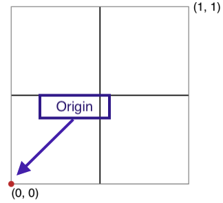
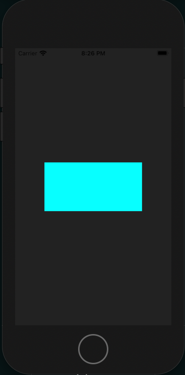
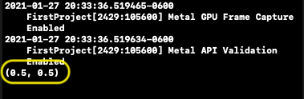
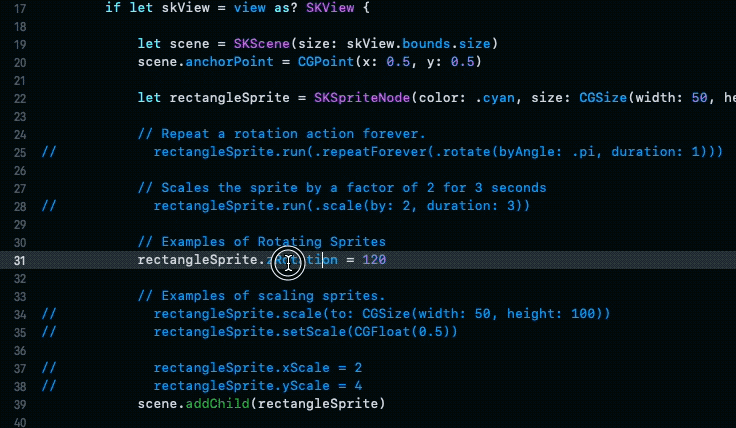
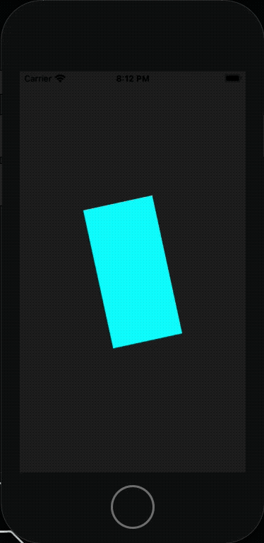
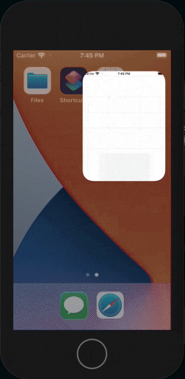
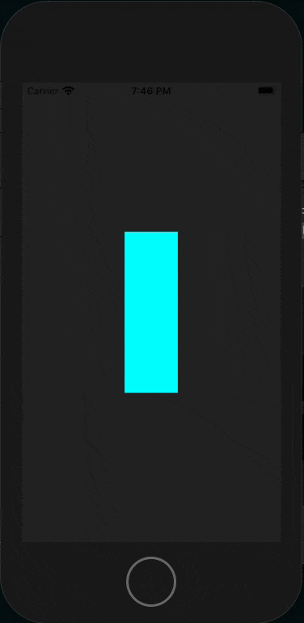
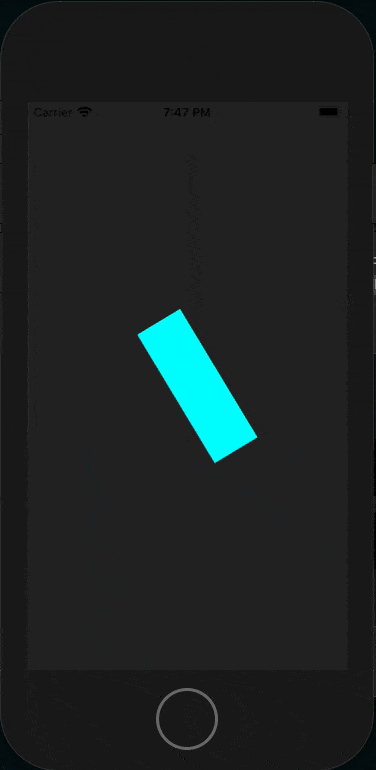

# SpriteKit Nodes

`SKNodes` can be a large topic. Almost everything that makes a up a game is essentially a node of some sort.

In previous tutorials, `SKShapeNodes` where used to draw a circle to the `SKScene`.  This tutorial will cover drawing `SKSpriteNodes` and moving them around on the screen. 

Keep in mind moving nodes around is just one thing that can be done with nodes. Nodes are used for almost everything in games. 

## Getting Started

Step 1. Create your project


Step 2. Set the `UIView` to use the `SKView` class


For simplicity everything in this tutorial will stay in the `ViewController.swift` file. It is recommended a new scene and class be created and used to setup the code examples found in the following sections. 

All of the items listed above are covered in the [previous](001-FirstProject.md) tutorial in detail.

## A Scene's Origin

A `SKScene`'s origin is where new nodes will be created. It is also the point from where nodes will be positioned when created. By default the scene's origin (`anchorPoint`) is in the bottom left-hand corner of the screen. 



A `SKScene` is also a node, in fact, it is always the root node of a node tree. When children nodes are created they are created at the origin of their parent node. 

The origin can be set by changing the `anchorPoint`, property of the scene.

```swift
scene.anchorPoint = CGPoint(x: 0.5, y: 0.5)
```

The `.anchorPoint` property is not in the `SKNode` class meaning not all nodes will have it, for example the `SKShapeNode` used in previous tutorials does not have it's own `anchorPoint`.

For deeper details about positioning, origins, and the `anchorPoint` property see the [documentation](https://developer.apple.com/documentation/spritekit/skscene/positioning_a_scene_s_origin_within_its_view).

## Setting Up the Scene

In the `MyScene.swift` file utilize the following code to set up our scene and create a rectangle. 


```swift
import SpriteKit

class MyScene: SKScene {
    
    override func didMove() {
        super.viewDidLoad()
        
        if let skView = view as? SKView {
            let scene = SKScene(size: skView.bounds.size)
            scene.anchorPoint = CGPoint(x: 0.5, y: 0.5)

            // Create a rectangle shape using SKSpriteNode(color:, size: CGSize)
            let rectangleSprite = SKSpriteNode(color: .cyan, size: CGSize(width: 200, height: 100))
            
            // print(rectangleSprite.anchorPoint)
            scene.addChild(rectangleSprite)
            
            skView.presentScene(scene)
        }
    }
}
```

Compile and run the code (++cmd+r++) to see the results. 



Verify the origin of the sprite by removing the commented out `print(rectangleSprite.anchorPoint)` statement. 



## SKActions

`SKActions` are used to perform actions on a sprite node such as:

- Moving
- Rotating
- Scaling
- Resizing
- Scaling
- Animating

There are many other things that can be done with `SKActions`. For greater details see the `Action Initializers` section of the `SKAction` [documentation](https://developer.apple.com/documentation/spritekit/skaction).

## Getting Help Quickly

This is a good point to pause and explain how to get help quickly from in the Xcode editor. The next couple of sections use partial code examples and some may be confusing. 

For example there will be a `.zRotation` property that can be modified. This property isn't exactly self-explanatory so being able to reference the relative documentation quickly can be helpful. 

To do this hover over the method name hold the ++option++ key and click the method name. 




## Animating Sprites

### Rotating a Sprite

There are different ways to rotate sprites. Below are some example methods. See the [full code sample](#full-code-sample) section of this tutorial for a full example of these methods.

```swift
rectangleSprite.zRotation = 1
```

To rotate a sprite using an `SKAction` adding the following code to the previous code example:

```swift
// ...
scene.anchorPoint = CGPoint(x: 0.5, y: 0.5)

let rectangleSprite = SKSpriteNode(color: .cyan, size: CGSize(width: 200, height: 100))

// Create an action to rotate the rectangle by an angle of PI for a time interval of 1 second
let rotateAction = SKAction.rotate(byAngle: .pi, duration: 1)
// Create an action that will repeat the rotateAction forever
let repeatingAction = SKAction.repeatForever(rotateAction)
// Run the repeatingAction on the rectangleSprite
rectangleSprite.run(repeatingAction)

// The line commented out below is shorthand for the three lines above.
// rectangleSprite.run(.repeatForever(.rotate(byAngle: .pi, duration: 1)))
scene.addChild(rectangleSprite)

skView.presentScene(scene)
// ...
```

> Be careful not to confuse `.rotate(byAngle:, duration:)` with `.rotate(toAngle:, duration:)`. The `SKAction.repeatForever(action:)` function will not work with `.rotate(toAngle:, duration:)`. 

Using `SKAction` initializers two actions are created in the code above. The first action, `rotateAction` uses `SKAction.rotate(byAngle:, duration:)` to rotate a node counter clockwise by an angle of `pi`. The `duration` in the time interval in which the action should complete. In the example above the rectangle should complete one full rotation over a time period of one second. 

The second `SKAction`, `SKAction.repeatForever(action:)`, is used to take the `rotateAction` and repeat it forever. 




### Scaling Nodes 

Just like rotating sprites there are different ways to scale down nodes. A few examples are listed below:

```swift
// Using the scale(to:) method
rectangleSprite.scale(to: CGSize(width: 50, height: 100))

// Using the setScale(_, scale:) method
rectangleSprite.setScale(CGFloat(0.5))

// Setting the xScale and yScale properties manually.
rectangleSprite.xScale = 2
rectangleSprite.yScale = 4
```

You will notice that when the app loads the rectangle is already scaled and there is no animation. Scaling animations can be achieved using `SKActions`. 

```swift
rectangleSprite.run(.scale(by: 2, duration: 3))
```

There are many different ways to scale a sprite using `SKActions` the above example is not the only way to do it. Refer to the Action Initializers section [documentation](https://developer.apple.com/documentation/spritekit/skaction/action_initializers) for more details. 

### Moving Nodes 

Moving nodes around can be done setting the `position` property of a node as seen below:

```swift
rectangleSprite.position = CGPoint(x: 80, y: 100)
```

Using `SKActions` movement can be animated.

```swift
rectangleSprite.run(.moveBy(x: 80, y: 100, duration: 3))
```

Once again the `SKAction.moveBy(x:, y:, duration:)` method is not the only one that can be used to animate sprite movement.  

### Multiple SKActions

`SKActions` can be used to animate many things. Actions can also be combined to use a sequence of actions. This can be used to create better visual effects. 

For example maybe a player picks up a power up item and it causes the sprite to grow large then small and then large again. This can be achieved using `SKActions.sequence(actions: [SKAction])` function. 

To do this there are some code modifications. Move the creation of the `rectangleSprite` above the `viewDidLoad()` method. Then add a new function below the `viewDidLoad()` method. The movement of the `rectangleSprite` is so it can be used in the new function.

```swift
// ...

class ViewController: UIViewController {

     let rectangleSprite = SKSpriteNode(color: .cyan, size: CGSize(width: 50, height: 150))
    
    override func viewDidLoad() {
        super.viewDidLoad()
        //...
    }

    func powerUp(){
        let growAction = SKAction.scale(to: 1.5, duration: 0.25)
        let shrinkAction = SKAction.scale(to: 1.2, duration: 0.30)
        let growLargerAction = SKAction.scale(to: 1.9, duration: 0.25)
        let shrinkLessAction = SKAction.scale(to: 1.6, duration: 0.30)
        let finalGrowthAction = SKAction.scale(to: 2, duration: 1)
        
        let actionSequence = SKAction.sequence([growAction, shrinkAction, growLargerAction, shrinkLessAction, finalGrowthAction])
        
        rectangleSprite.run(actionSequence)
    }
}
```

Next call the `powerUp()` in the `viewDidLoad()` method.

```swift
//...

class ViewController: UIViewController {

    let rectangleSprite = SKSpriteNode(color: .cyan, size: CGSize(width: 50, height: 150))

    override func viewDidLoad() {
        super.viewDidLoad()
        //...

        powerUp()
        scene.addChild(rectangleSprite)
        //...
    }

    //...
}
```

## Full Code Sample

Below is a full code example with some bonus material. It is recommended to uncomment different statements to see what they look like. To uncomment lines quickly move the cursor to the line to uncomment then use holding the ++command++ key and pressing ++"/"++ to remove the `//` characters.

```swift
import UIKit
import SpriteKit

class ViewController: UIViewController {
    
    let rectangleSprite = SKSpriteNode(color: .cyan, size: CGSize(width: 50, height: 150))
    
    override func viewDidLoad() {
        super.viewDidLoad()
        
        
        if let skView = view as? SKView {
            
            let scene = SKScene(size: skView.bounds.size)
            scene.anchorPoint = CGPoint(x: 0.5, y: 0.5)
            
            
            // Repeat a rotation action forever.
//            rectangleSprite.run(.repeatForever(.rotate(byAngle: .pi, duration: 1)))
            
            // Scales the sprite by a factor of 2 for 3 seconds
//            rectangleSprite.run(.scale(by: 2, duration: 3))
            
            // Move the sprite using an SKAction
//            rectangleSprite.run(.moveBy(x: 80, y: 100, duration: 2))
            
            // Examples of rotatign sprites
//            rectangleSprite.zRotation = 1
            
            // Examples of scaling sprites.
//            rectangleSprite.scale(to: CGSize(width: 50, height: 100))
//            rectangleSprite.setScale(CGFloat(0.5))

//            rectangleSprite.xScale = 2
//            rectangleSprite.yScale = 4
            
            // Examples of moving sprites
//            rectangleSprite.position = CGPoint(x: 80, y: 100)
            
            // Example of growth animation
//            powerUp()
            
            // Example of pulse animation
//            pulse()
            
            // Example of flying death trap
//            fanOfDoom()
            
            scene.addChild(rectangleSprite)

            skView.presentScene(scene)
        }
    }
    
    func powerUp(){
        let growAction = SKAction.scale(to: 1.5, duration: 0.25)
        let shrinkAction = SKAction.scale(to: 1.2, duration: 0.30)
        let growLargerAction = SKAction.scale(to: 1.9, duration: 0.25)
        let shrinkLessAction = SKAction.scale(to: 1.6, duration: 0.30)
        let finalGrowthAction = SKAction.scale(to: 2, duration: 1)
        
        let actionSequence = SKAction.sequence([growAction, shrinkAction, growLargerAction, shrinkLessAction, finalGrowthAction])
        
        rectangleSprite.run(actionSequence)
    }
    
    func pulse(){
        let growAction = SKAction.scale(to: 1.5, duration: 0.25)
        let shrinkAction = SKAction.scale(to: 1.2, duration: 0.35)
        let actionSequence = SKAction.sequence([growAction, shrinkAction])
        let repeatingAction = SKAction.repeatForever(actionSequence)
        
        rectangleSprite.run(repeatingAction)
    }
    
    func fanOfDoom(){
        let moveAction = SKAction.moveTo(x: -120, duration: 2)
        let moveBackAction = SKAction.moveTo(x: 120, duration: 2)
        let rotateAction = SKAction.rotate(byAngle: .pi*8, duration: 4)
        let actionSequence = SKAction.sequence([moveAction, moveBackAction])
        
        // SKAction.group allows actions to run in parallel.
        let groupOfActions = SKAction.group([rotateAction, actionSequence])
        let repeatingAction = SKAction.repeatForever(groupOfActions)
        
        rectangleSprite.run(repeatingAction)
    }
}
```

PowerUp Example



Pulse Example



Fan of Doom Example



## Exercises 

- [ ] Play around with the full code example.
- [ ] Change the code and SKAction sequences around see what effects can be achieved.
- [ ] Create a new effect.
- [ ] Create a dying animation where the rectangle rotates, shrinks and fades out all at the same time.

*Solutions Coming Soon*

## References 

- [SKScene](https://developer.apple.com/documentation/spritekit/skscene)
- [SKScene Origin](https://developer.apple.com/documentation/spritekit/skscene/positioning_a_scene_s_origin_within_its_view)
- [SKNodes](https://developer.apple.com/documentation/spritekit/sknode)
- [SKSpriteNodes](https://developer.apple.com/documentation/spritekit/skspritenode)
- [SKActions](https://developer.apple.com/documentation/spritekit/skaction)