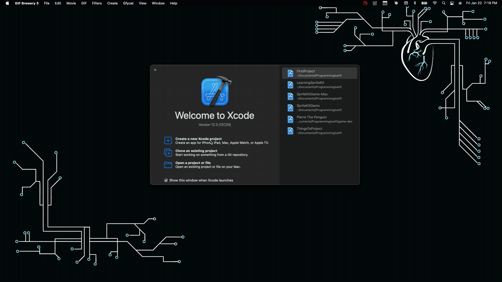
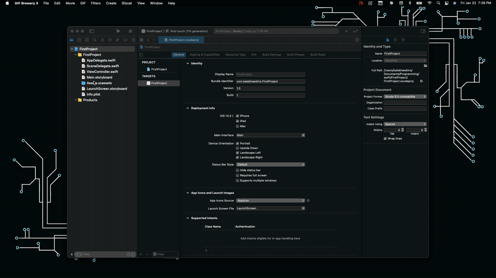
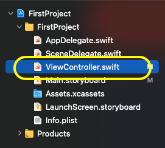
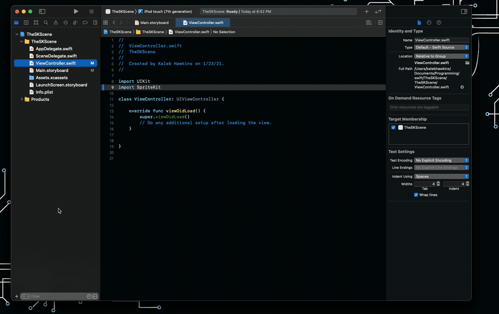
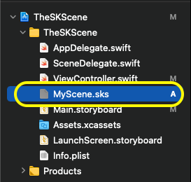
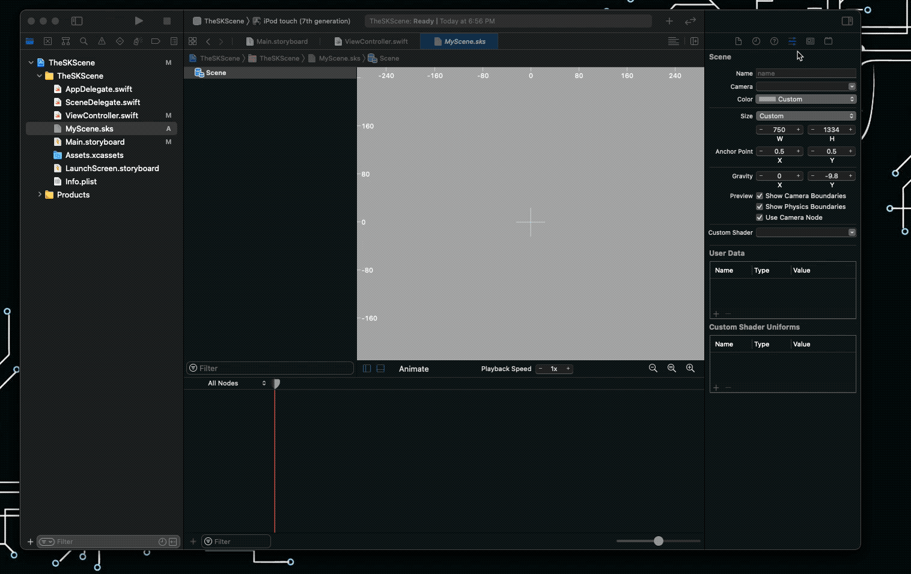
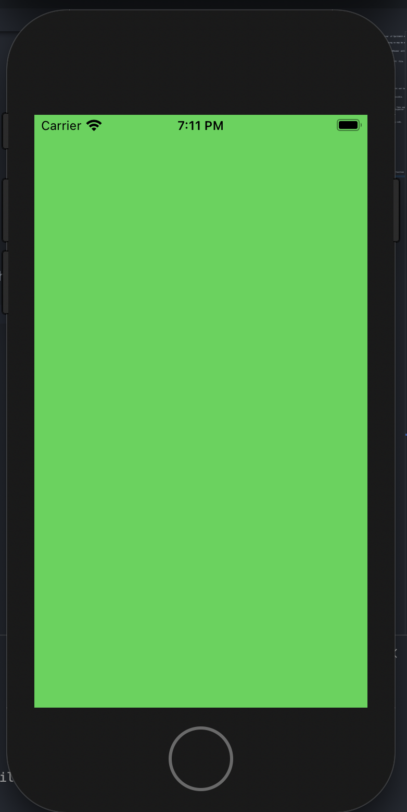
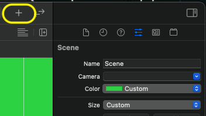
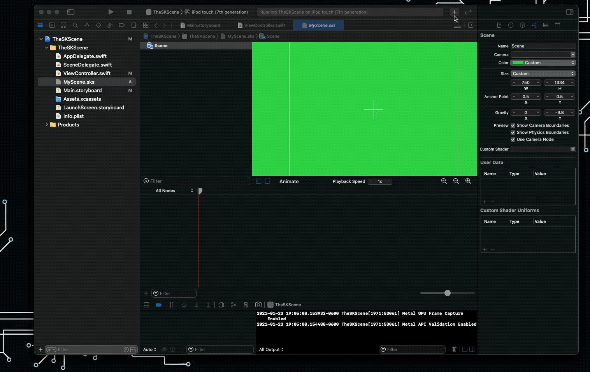
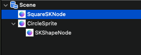

# The SKScene Class

A `SKScene` object represents a scene of content in Spritekit. A scene is the `root` node in a `tree` of Spritekit nodes (`SKNodes`). The nodes provide content that the scene animates and renders for display. 

`SKScene` is a subclass of `SKEffectNode` and enables certain effect to apply to the entire scene. Enabling effects across an entire scene may be an expensive operation so use this cautiously. 

## Creating a Scene File

In the [last tutorial](./001-FirstProject.md) a `SKScene` was created programmatically. This time the `SKScene` will be created from an `.sks` scene file. 

Step 1. Start by creating a new `Single App View` project as done in the previous tutorial. 



Step 2. Set the UIView to use the SKView class in the `Main.Storyboard` file. 



Step 3. Import Spritekit into your project using the `import Spritekit` statement within the `ViewController.swift` file. 



```swift
import UIKit
import Spritekit
//...
```


To create a `.sks` scene file press ++cmd+n++ enter scene in the filter and select `Spritekit Scene`. Careful not to select `Scenekit Scene`. 



This will put you in Xcode's scene editor. This is where base scene configuration should take place when possible.  


## Modifying the Scene

It is faster to edit the base scene from the editor and it cuts down on code pollution in the source files. Take some time to explore and get a feel for what can be done with the editor. For example changing the background color can be done by clicking the `Attributes Inspector` and selecting the color your the `color` attributes.



## Linking the Scene

Now to link the file up to the code. Navigate back to the `ViewController.swift` file and use the following code.

```swift
import UIKit
import SpriteKit

class ViewController: UIViewController {

    override func viewDidLoad() {
        super.viewDidLoad()
        
        if let skView = view as? SKView {
            // Use the SKScene(fileName:) function to load the scene.
            // The string "MyScene" comes from the name of the sks file.
            // So if the name of the file was Level01.sks you would replace "MyScene" with "Level01"
            let scene = SKScene(fileNamed: "MyScene")
            
            // Present the scene
            skView.presentScene(scene)
        }
    }
}
```

The code above looks almost identical to the code in the previous tutorial. The exception is the `SKScene` function is initialized with the filename of the `.sks` file. 

Hitting the ++cmd+r++ keys will compile and run your code. This time the background should be the same color chosen from the `attributes` tab in the `.sks` file. It may take a few seconds to load up the first time it is ran so be patient. It should not take longer the a minute.



## Adding Sprite's to the Scene

You can can sprites and nodes to the scene using the editor as well. Back in the `.sks` file click the `+` button in the upper right hand corner of the scene editor. 




Watch the above animation carefully and notice that when the `Circle Sprite` is placed it has a square shape. The reason for this is explained in a later tutorial. 

Notice also that the context of the attributes editor changes when selecting a node. This allows for different aspects of the node to be modified. 

## The Scene's Node Tree

When building the scene you want to keep nodes organized in larger projects. The editor allows you to visualize your nodes in a tree-like structure. Nodes can be nested and organized. When a node is nested below another node it becomes a `child` or it's `parent` node. Things like inheritance for certain attributes take place unless overridden by the child node. These are important concepts to keep in mind. 



## Congratulations 

You made it through another tutorial. I hope you have a good understanding of SKScenes and how to change a scene's attribute, add nodes, and change attributes of those nodes. There are many things you can do with the `SKScene` object:

- Stretch the Content to Fit the View
- Configure the ViewPort (Define what part of the scene is visible at a given time)
- Respond to loading and resizing events
- Respond to Frame-Cycle events
- Delegating a scene
- Change background appearance 
- Configure Physics
- Add positional audio

Note that a `SKScene` inherits from the `SKEffectNode`. That means anything that can be done with the `SKEffectNode` can be performed on a `SKScene`. These action can include:

- Apply Core Image Filters
- Warping Nodes
- Applying Shaders
- Flatten Node Tree's for improved performance
- Configure Alpha blending

In the next tutorial we will be adding some movement to a `SKShapeNode`. 

## Exercises 

These exercises may seem a bit dull but they are beneficial. Don't try to memorize everything. The documentation is there for a reference when needed. Do put what you learn to practice while learning it. This will re-enforce the concepts. The same principle applies for learning any skill. 

- [ ] Create a new scene with a different background color
- [ ] Read the `SKScene` Documentation (see the [References](#references))
- [ ] Change the Scenes `origin`
- [ ] Set the position of a node using the editor
- [ ] Try to configure physics (you will need a node with a `physicsbody`)
- [ ] Understand the `sceneDidLoad()`, `didChangeSize(CGSize:)`,  `willMove(from: SKView)`, `didMove(to: SKView)` functions and how/when to use them
- [ ] Review the `Conforms To` and `Essentials` section of `SKScene` documentation
- [ ] Bonus points for getting audio to work

Make it through all of the exercises and still don't understand something? That is OK. Understanding comes with time. Future tutorials will cover each of these items in greater detail.

*Solutions Coming Soon*

## References

- [SKScene Documentation](https://developer.apple.com/documentation/spritekit/skscene)
- [SKScene Origin](https://developer.apple.com/documentation/spritekit/skscene/positioning_a_scene_s_origin_within_its_view)
- [Creating a SKScene from File](https://developer.apple.com/documentation/spritekit/skscene/creating_a_scene_from_a_file)
- [Contains All Answers to the Exercises](https://www.google.com/)

## Extra Reading

The link below is the documentation explaining different nodes and node types. It is recommended you at least read over the section `Using Base Nodes to Lay Out SpriteKit Content` and `Maximizing Node Drawing Performance` to get a general idea of the capabilities of different nodes.

- [Nodes for Scene Building](https://developer.apple.com/documentation/spritekit/nodes_for_scene_building#2242745)
